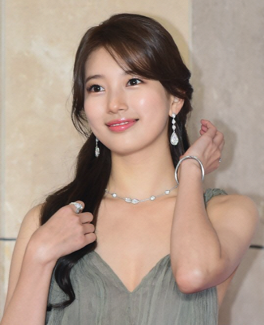
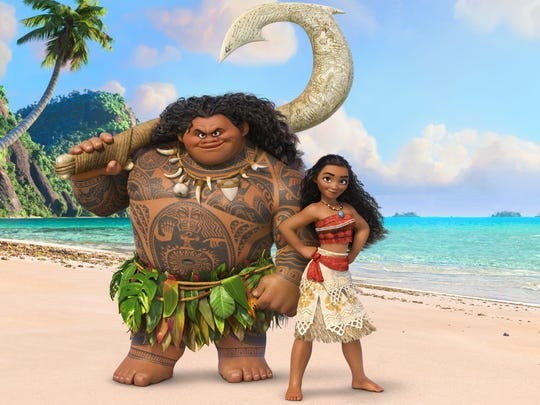
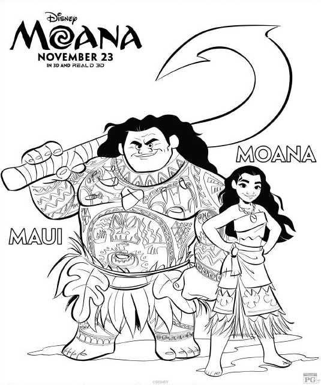

# Project YOCO(Your Own Coloring book)  

## Contents  

- [**Weekly Record**](https://github.com/7-B/yoco#weekly-recordsweek1week5)  
- [**Reference**](https://github.com/7-B/yoco/wiki/%EC%B0%B8%EA%B3%A0-%EC%9E%90%EB%A3%8C)  
-  
-   

# Weekly records(Week1~Week5)   
 ### 1. Week1  
- Test opensource style transfer  [Deep Photo Style Transfer ](https://arxiv.org/abs/1703.07511)[(Github repo)](https://github.com/luanfujun/deep-photo-styletransfer)   
 **+**   **=**        

- __문제점__ : 얼굴,피부,머리,옷,배경 등을 Segmentation시킬 필요가 있음, 노이즈 제거 등    
---  
- ### 회의기록    
**1. 하고싶은바(구체적으로)**   
  - 내사진(input) -> 컬러링북(output)   
  **Our Goal :**  **->**  
  - 차별점 : 그냥 선따기만 하는게 아니고, 일정한 패턴들이 폐곡선을 구성하여 시중 컬러링 북과 같은 느낌을 내는 것이 목표.   
  - GAN으로 1차 이미지 생성(Draft) -> Edge Detection/Denoising autoencoder 와 같은 기법으로 다듬어서 결과 이미지 생성   

**2. (예상)데이터셋 구축 & 모델링 방법 제안**   
  - 3 Suggestions    
  - 1. 희태 + 준
  - 2. 세원+유라
  - 3. 예진+미희+ 덕민  

**3. 필요 기술(필수) 및 요구사항**  
- 데이터셋을 어떻게 구성 할 것인지(가장 중요할 듯)  
- GAN을 적용하여 어떻게 컬러링북스타일을 학습/추론 할 것인지(How to determine What Generator/Discriminator is?)  
- (오브젝트디텍션+세그멘테이션+라벨링)->YOLO로? But, YOLO는 외곽선따는게 아니고 Bounding Box 생성하는 문제점    
- Input 사진 제한해야할 것으로 예상됨(ex: 사람 상반신 사진)   
- (추후)Edge Detection/Denoising autoencoder 와 같은 후처리 기법 조사 필요  
- [현재 Edge Detection 방법으로는 딱 이거다 라고 결정 지을 수는 없음(Controversial한 영역)](https://www.reddit.com/r/computervision/comments/8jjkjp/what_is_the_state_of_the_art_algorithm_for_edge/) -> 우리 프로젝트에 적합한 엣지검출 방법을 찾아야함  

**4. 더 자세한 계획/역할분담은 내일(8월23일, 금) 자문 받고 결정**   

**5. 매 주단위로 계획 세워서 실천합시다~ 화이팅~!**   
---  
## Collaborators  
- 김덕민  
- 김  준  
- 노희태  
- 서유라  
- 이세원  
- 진예진  
- 한미희  
