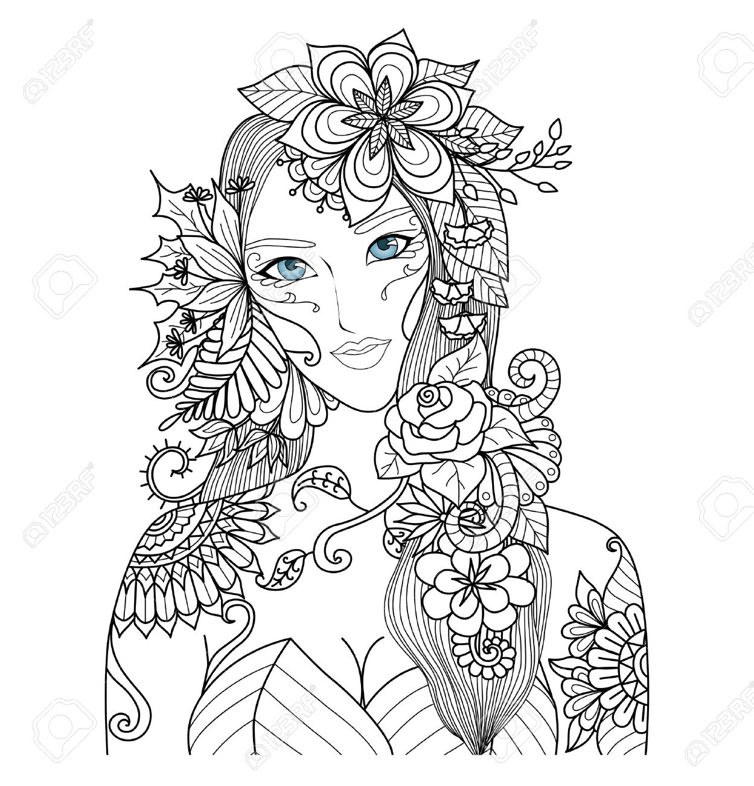
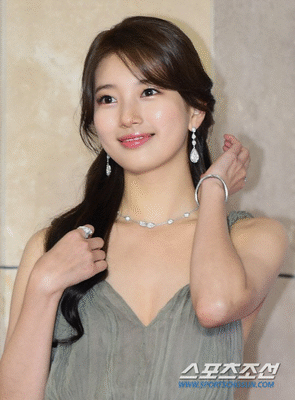

# Project YOCO(Your Own Coloring book)  

## Contents  

- [**Weekly Record**](https://github.com/7-B/yoco#weekly-recordsweek1week5)  
- [**Reference**](https://github.com/7-B/yoco/wiki/%EC%B0%B8%EA%B3%A0-%EC%9E%90%EB%A3%8C)  
-  
-   

# Weekly records(Week1~Week5)   
 ### 1. Week1  
Test opensource style trnasfer  [Deep Photo Style Transfer ](https://arxiv.org/abs/1703.07511)[(Github repo)](https://github.com/luanfujun/deep-photo-styletransfer)
 
  
- ### Result
  
- 문제점 : 얼굴,피부,머리,옷,배경 등을 Segmentation시킬 필요가 있음, 노이즈 제거 등

## Collaborators  
- 김덕민  
- 김  준  
- 노희태  
- 서유라  
- 이세원  
- 진예진  
- 한미희  
