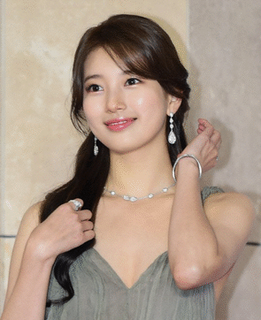
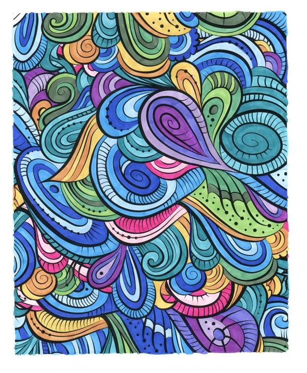
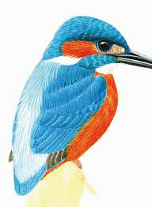
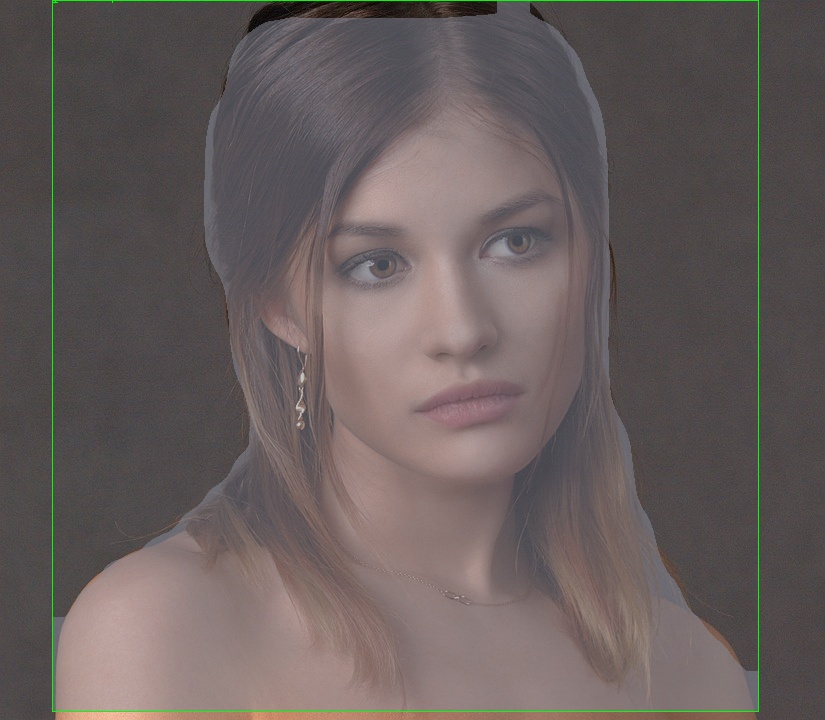

# Project YOCO(Your Own Coloring book)  

## Contents  

- [**Weekly Record**](https://github.com/7-B/yoco#weekly-recordsweek1week5)  
- [**Reference**](https://github.com/7-B/yoco/wiki/%EC%B0%B8%EA%B3%A0-%EC%9E%90%EB%A3%8C)  
-  
-   

# Weekly records(Week1~Week5)    
 

 Week1 

- Test opensource style transfer  [Deep Photo Style Transfer ](https://arxiv.org/abs/1703.07511)[(Github repo)](https://github.com/luanfujun/deep-photo-styletransfer)   

>  **+**   **=**        

>  **+**   **=**        

- __문제점__ : 얼굴,피부,머리,옷,배경 등을 Segmentation시킬 필요가 있음, 노이즈 제거 등    
---  
- ### 회의기록    
**1. 목표(구체적으로)**   
  - 내사진(input) -> 컬러링북(output)   
  **Our Goal :**  **->**  
  - 차별점 : 그냥 선따기만 하는게 아니고, 일정한 패턴들이 폐곡선을 구성하여 시중 컬러링 북과 같은 느낌을 내는 것.   
  - GAN/Image Segmentation등 으로 1차 이미지 생성 -> Edge Detection/Denoising autoencoder 와 같은 기법으로 다듬어서 결과 이미지 생성   

**2. (예상)데이터셋 구축 & 모델링 방법 제안**   
  - 3 Suggestions    
  - 1. 희태 + 준
  - 2. 세원+유라
  - 3. 예진+미희+ 덕민  

**3. 필요 기술(필수) 및 요구사항**  
- 데이터셋을 어떻게 구성 할 것인지(가장 중요할 듯)  
- GAN을 적용하여 어떻게 컬러링북스타일을 학습/추론 할 것인지(How to determine What Generator/Discriminator is?)  
- ~~(오브젝트디텍션+세그멘테이션+라벨링)->YOLO로? But, YOLO는 외곽선따는게 아니고 Bounding Box 생성하는 문제점~~ -> YOLO는 segmentation하지 않음, mmdetection으로 segmentation     
- Input 사진 제한해야할 것으로 예상됨(ex: 사람 상반신 사진)   
- (추후)Edge Detection/Denoising autoencoder 와 같은 후처리 기법 조사 필요  
- [현재 Edge Detection 방법으로는 딱 이거다 라고 결정 지을 수는 없음(Controversial한 영역)](https://www.reddit.com/r/computervision/comments/8jjkjp/what_is_the_state_of_the_art_algorithm_for_edge/) -> 우리 프로젝트에 적합한 엣지검출 방법을 찾아야함  

- 0824토요일  
  - [mmdetection](https://github.com/open-mmlab/mmdetection)으로 인물/배경 분리 성공  
  >    
  - 자세한 알고리즘은 슬라이드에  
  - 선을 딴 이미지에다가 패턴을 합성할 때에 어떤 기술을 적용해야 하는지 의문. -> 당장은 GAN이 떠오르긴 하지만, GAN은 연속적인 명암 및 색상을 가진 fake Image를 생성하는 기술인 것 같은데, line image -> Patterned line image인 우리 프로젝트에 GAN을 이용하는것이 맞는건가?  

**4. 더 자세한 계획/역할분담은 연구실 자문 받고 결정**   

---  

 Week2 

   
 
 - 정보통신연구소 **이영현** 연구원님(dudgus1727@postech.ac.kr)자문(8/28 수요일 오후 1시 30분)    
   - 굳이 GAN으로 안해도 될 것 같다. CNN 세개를 병렬적으로 하면 될 것 같다.(예시: Style CNN, Result CNN, Input CNN)    
   - 모델을 바닥부터 만드는 것은 비추천이고, pre-trained 모델 사용 권유.  
   - 색깔빼거나 엣지따는 작업을 따로 안해도 될 수도 있는데, 일단 해봐야지 알 것 같다.  
   - 세그멘테이션이 잘 되는것이 가장 중요하다. 세그멘테이션 네트워크로는 U-Net 이 가장 많이 쓰인다. [U-Net 이란?](https://modulabs-biomedical.github.io/U_Net)  
   이미지 네트워크는 ImageNet을 추천한다. 가장 범용적인 Feature map 추출 네트워크이다.   
   - 어떤 데이터셋이 필요할지는 생각을 해봐야겠지만, 일단 짝(인물사진<->컬러링북사진)으로 맞춰진 데이터까지는 필요 없을 것 같다.  
   - 그 외 기억나는 내용 있으면 추가 바람.
   
 - 희태가 찾은 자료 : 
   - [Semantic Segment Style Transfer, Stanford](http://cs231n.stanford.edu/reports/2017/pdfs/404.pdf)  
   - [Automated Deep Photo Style Transfer](https://github.com/Spenhouet/automated-deep-photo-style-transfer) -> 여기서 세그멘테이션 부분을 우리꺼에 맞게 수정하면 될 것 같음.  
 - 일단 주말동안 딥러닝 전반적인 내용 및 CNN,이미지 세그멘테이션 등에 대해 각자 공부를 열심히 하고 월요일에 다시 달립시다. 
 - 9/5일(월)부터 웹 개발 시작 예정. 레이아웃은 다 같이 회의로 정하고 구현은 덕민/세원 중심으로.(준,예진 서포트)   
 

    

---  

  

 Collaborators 

 
   
- 김덕민    
 
- 김   준    

- 노희태    

- 서유라   

- 이세원   

- 진예진    

- 한미희

  
