# Project YOCO(Your Own Coloring book)  


## Contents  


- [**Weekly Record**](https://github.com/7-B/yoco#weekly-recordsweek1week5)  
- [**Reference**](https://github.com/7-B/yoco/wiki/%EC%B0%B8%EA%B3%A0-%EC%9E%90%EB%A3%8C)  
-  
-   


# Weekly records(Week1~Week5)    
 
<details>
<summary> Week1 </summary>
<div markdown="1">
- Test opensource style transfer  [Deep Photo Style Transfer ](https://arxiv.org/abs/1703.07511)[(Github repo)](https://github.com/luanfujun/deep-photo-styletransfer)   

>  **+** 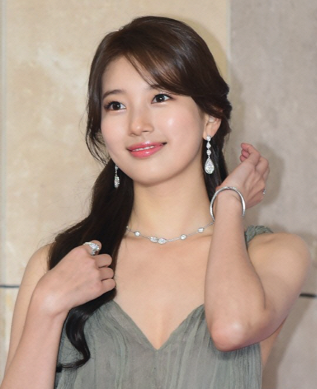  **=**   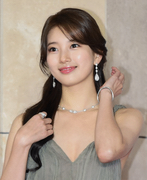     

> 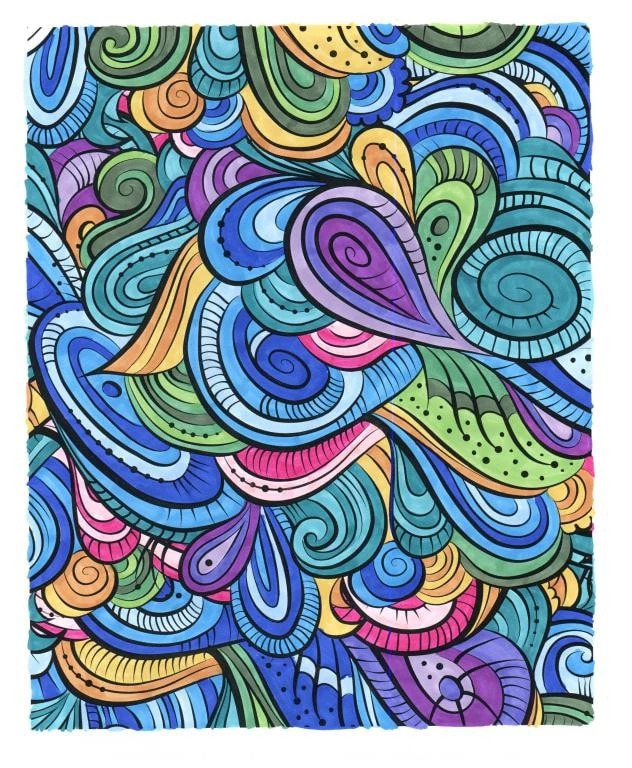 **+**   **=**   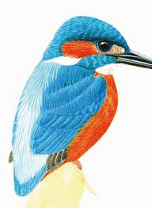     


- __문제점__ : 얼굴,피부,머리,옷,배경 등을 Segmentation시킬 필요가 있음, 노이즈 제거 등    
---  
- ### 회의기록    
**1. 목표(구체적으로)**   
  - 내사진(input) -> 컬러링북(output)   
  **Our Goal :** 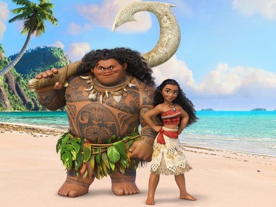 **->** 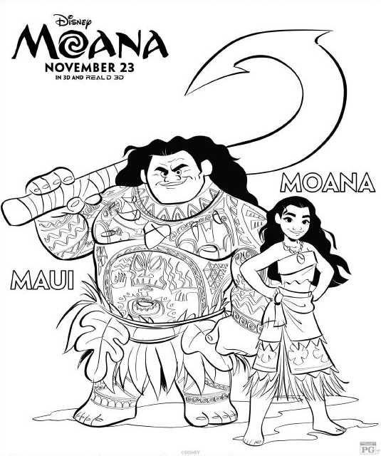 
  - 차별점 : 그냥 선따기만 하는게 아니고, 일정한 패턴들이 폐곡선을 구성하여 시중 컬러링 북과 같은 느낌을 내는 것.   
  - GAN/Image Segmentation등 으로 1차 이미지 생성 -> Edge Detection/Denoising autoencoder 와 같은 기법으로 다듬어서 결과 이미지 생성   

**2. (예상)데이터셋 구축 & 모델링 방법 제안**   
  - 3 Suggestions    
  - 1. 희태 + 준
  - 2. 세원+유라
  - 3. 예진+미희+ 덕민  

**3. 필요 기술(필수) 및 요구사항**  
- 데이터셋을 어떻게 구성 할 것인지(가장 중요할 듯)  
- GAN을 적용하여 어떻게 컬러링북스타일을 학습/추론 할 것인지(How to determine What Generator/Discriminator is?)  
- ~~(오브젝트디텍션+세그멘테이션+라벨링)->YOLO로? But, YOLO는 외곽선따는게 아니고 Bounding Box 생성하는 문제점~~ -> YOLO는 segmentation하지 않음, mmdetection으로 segmentation     
- Input 사진 제한해야할 것으로 예상됨(ex: 사람 상반신 사진)   
- (추후)Edge Detection/Denoising autoencoder 와 같은 후처리 기법 조사 필요  
- [현재 Edge Detection 방법으로는 딱 이거다 라고 결정 지을 수는 없음(Controversial한 영역)](https://www.reddit.com/r/computervision/comments/8jjkjp/what_is_the_state_of_the_art_algorithm_for_edge/) -> 우리 프로젝트에 적합한 엣지검출 방법을 찾아야함  

- 0824 토요일  
  - [mmdetection](https://github.com/open-mmlab/mmdetection)으로 인물/배경 분리 성공  
  > 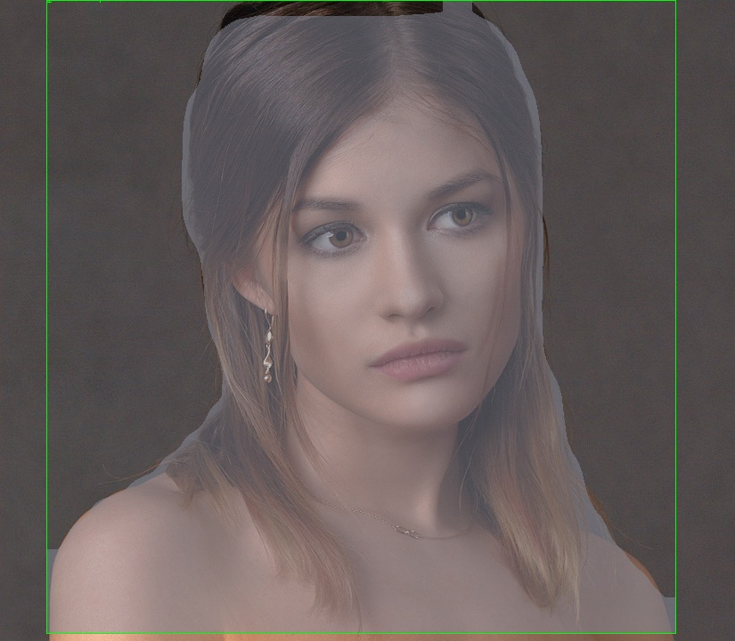   
  - 자세한 알고리즘은 슬라이드에  
  - 선을 딴 이미지에다가 패턴을 합성할 때에 어떤 기술을 적용해야 하는지 의문. -> 당장은 GAN이 떠오르긴 하지만, GAN은 연속적인 명암 및 색상을 가진 fake Image를 생성하는 기술인 것 같은데, line image -> Patterned line image인 우리 프로젝트에 GAN을 이용하는것이 맞는건가?  

**4. 더 자세한 계획/역할분담은 연구실 자문 받고 결정**   

</div>
</details>

---  
<details>
<summary> Week2 </summary>
<div markdown="1">   
 
 - 정보통신연구소 **이영현** 연구원님(dudgus1727@postech.ac.kr)자문(8/28 수요일 오후 1시 30분)    
   - 굳이 GAN으로 안해도 될 것 같다. CNN 세개를 병렬적으로 하면 될 것 같다.(예시: Style CNN, Result CNN, Input CNN)    
   - 모델을 바닥부터 만드는 것은 비추천이고, pre-trained 모델 사용 권유.  
   - 색깔빼거나 엣지따는 작업을 따로 안해도 될 수도 있는데, 일단 해봐야지 알 것 같다.  
   - 세그멘테이션이 잘 되는것이 가장 중요하다. 세그멘테이션 네트워크로는 U-Net 이 가장 많이 쓰인다. [U-Net 이란?](https://modulabs-biomedical.github.io/U_Net)  
   이미지 네트워크는 ImageNet을 추천한다. 가장 범용적인 Feature map 추출 네트워크이다.   
   - 어떤 데이터셋이 필요할지는 생각을 해봐야겠지만, 일단 짝(인물사진<->컬러링북사진)으로 맞춰진 데이터까지는 필요 없을 것 같다.  
   - 그 외 기억나는 내용 있으면 추가 바람.
   
 - 희태가 찾은 자료 : 
   - [Semantic Segment Style Transfer, Stanford](http://cs231n.stanford.edu/reports/2017/pdfs/404.pdf)  
   - [Automated Deep Photo Style Transfer](https://github.com/Spenhouet/automated-deep-photo-style-transfer) -> 여기서 세그멘테이션 부분을 우리꺼에 맞게 수정하면 될 것 같음.  
 - 일단 주말동안 딥러닝 전반적인 내용 및 CNN,이미지 세그멘테이션 등에 대해 각자 공부를 열심히 하고 월요일에 다시 달립시다. 
 - 9/5일(월)부터 웹 개발 시작 예정. 레이아웃은 다 같이 회의로 정하고 구현은 덕민/세원 중심으로.(준,예진 서포트)   

 - #### 0901 일요일  
   - [sketchKeras](https://github.com/lllyasviel/sketchKeras)와 [sketch_simplification](https://github.com/bobbens/sketch_simplification)소스코드를 main.py에서 한번에 구동되도록 통합.  
   - 선따는 과정은 크게 다음과 같다.  
     - 원본이미지 -> 스케치화된 이미지 -> 노이즈제거된 선따기된 이미지  
     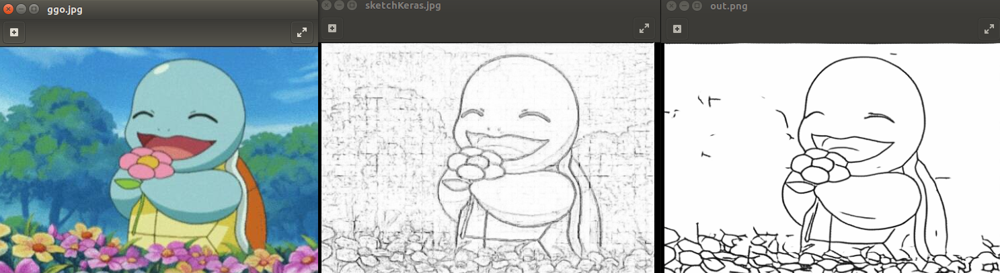  
   - ### **사용법**  
   Environment : Anaconda Virtual Environment  
   Python Version : Python 3.6.9 (3점대 버전이면 크게 상관없음)  
   **Anaconda 가상환경에서 하는것을 권장합니다.**    
   
   1. 현재 저장소를 Clone 받고, develop branch로 checkout 한다.
   ```
   git clone https://github.com/7-B/yoco.git
   git checkout develop
   ```
   2. 필요한 Package들을 받는다.(Keras, Pytorch, openCV 등...단, Pytorch는 반드시 version 0.4.1 이어야 함.)
   ```
   pip install -r requirements.txt
   ```
   3. 프로젝트 경로에 sketchKeras를 구동할 Model을 다운받는다(약 200MB).  
   [Click here to download](https://github.com/lllyasviel/sketchKeras/releases/download/0.1/mod.h5)  
     
   4. sh파일을 실행시켜 sketch_simplification을 구동할 Model을 다운받는다(약 300MB).
   ```
   bash download_models.sh
   ```
   
   5. 다음 명령어로 실행한다.
   ```   
   python main.py --img <Image File Name>
   ex) python main.py --img big_ggo.jpg
   ```  
   6. 그럼 현재 경로에 raw.jpg, sketchKeras.jpg, out.png 이미지 파일들이 생성된다.  
   - **raw.jpg** : 원본이미지를 openCV가 사용하도록 생성한 이미지 파일.(원본 이미지와 같음)  
   - **sketchKeras.jpg** : raw.jpg를 sketchKeras 구동한 결과물(스케치화된 이미지).  
   - **out.png** : sketchKeras.jpg를 simplify시켜 노이즈를 제거하고 깨끗하게 만든 이미지.    
   
   - ### 문제점  
     
   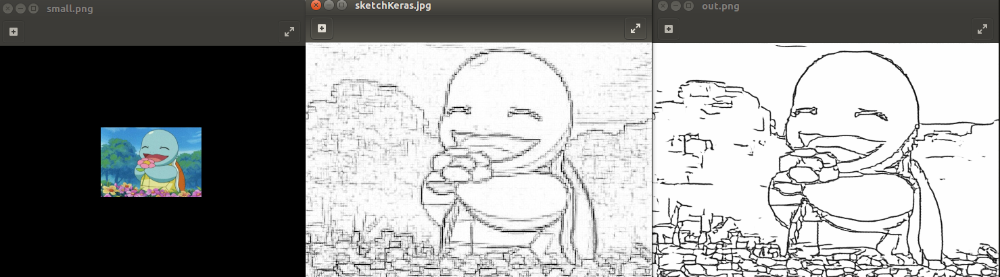  
   
   - 위 그림과 같이, 원본 사진의 해상도가 작을경우 픽셀이 깨지는 경우가 있는데, 상용화단계가 아니면 신경쓰지 않아도 될 것 같다. 
   - 모델 파일(mod.h5, model_gan.t7 등)의 용량이 아주 큰데 웹에 어떻게 올리지?  
   - 좀 느리다.(10초 정도 걸림) 일단은 빠르게 구동해보려고 GPU 사용하지 않도록 세팅 되어있음.  
   
   - ### Next ToDo  
   - sketchKeras와 sketch_simplification 의 논문이나 프로젝트페이퍼, 소스코드를 자세히 읽어보고 완전이 파악한 후 커스터마이징 할 부분이 있다면 할 수 있도록 해야함.(파라미터조정, 파일입출력, 함수간의 호출 관계 등)    
   - 선딴 결과물에 패턴 입히는게 관건이고, 여기서부터가 머신러닝/딥러닝을 우리가 구현해야할 핵심적인 부분  
   - 이상적인 Patternise 계획  
   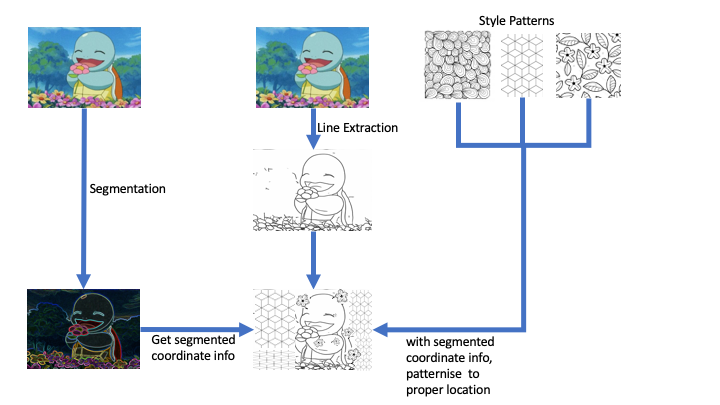   
   
   - Segmentation이 잘 되어야 하고, 나눠진 구역을 구분하면서 적절한 패턴을 예쁘게 입히는게 가장 중요함.  
   - 무슨 모델로 어떻게 학습해서 어떻게 적용해야하지...?  -> 고민....  
   - 가능하다면 GPU자원을 쓰면 훨씬 빠를 것 같은데, 코드를 좀 손 봐야함. 나중에 하기.   

   
   
 
</div>
</details>    

---  

<details>
<summary> Week3 </summary>
<div markdown="1">
 
 - #### 0902 월요일  
    - **Web**
      - 세원, 덕민 개발 시작. 연습 충분히 한 후 깃허브 저장소 따로 만들어서 진행.    
      - 레이아웃은 최대한 간단히 하고, 사진 올리면 클라이언트의 이메일로 결과이미지 보내주는 로직까지 구현 목표   
      - 실시간으로 결과이미지 출력하는게 어려울 것 같으니 일단은 이메일 발송으로 구현하기       
      - 나중에 여유 되면 Docker 활용하여 GPU 사용할 수 있도록 만들기(지속가능성 점수 따기 좋을듯)  
    - **Segmentation**  
      - [Human Parsing SOTA 랭킹 사이트](https://paperswithcode.com/task/human-parsing)  
        - 희태 : [Instance-level Human Parsing via Part Grouping Network](https://github.com/Engineering-Course/CIHP_PGN) 모델 트레이닝 중
        - 준 : [Macro-Micro Adversarial Network for Human Parsing Pre-trained model](https://github.com/RoyalVane/MMAN) 
          - CUDA Version 어쩌고 오류 남          
        - 예진 : [Multi-Human-Parsing_MHP](https://github.com/ZhaoJ9014/Multi-Human-Parsing) 해봤는데 잘 안됨  
        

 - #### 0903 화요일  
     - **Web**
       - 거의 다 함(?)    
    - **Segmentation**  
      - 희태 : ~~[Instance-level Human Parsing via Part Grouping Network](https://github.com/Engineering-Course/CIHP_PGN) 모델 트레이닝 중 -> 잘 안됨(결과 이상??)~~    
        - [CIHP_PGN](https://github.com/Engineering-Course/CIHP_PGN) Matlab 까는중
      - 준 : [Macro-Micro Adversarial Network for Human Parsing](https://github.com/RoyalVane/MMAN)  
        - PyTorch 0.3.1 버젼으로 학습하는 코드라서 우리꺼랑 안맞음(SketchSimplify할때 PyTorch 0.4.1 버전이라 충돌 남)  
        - **PyTorch 0.4.1 cuda 9.0 설치방법(PyTorch 0.4.1에서 cuda 10.0은 호환안됨)**  
          [Anaconda에서 CUDA, cudnn 사용 및 환경변수 설정법](https://light-tree.tistory.com/59)  
          CUDA 9.0을 우선 깔고(위 링크 참고, NVIDIA Driver는 우리 컴에 깔려있는 걸로 설치해야함 안그럼 무한루프~), 
          그에 맞는 PyTorch 0.4.1을 설치한다.   
          ```
          $ conda install pytorch=0.4.1 cuda90 -c pytorch
          ```  
          cuda 9.0이 잘 깔렸는지 경로에 가서 확인한다.  
          ```
          $ cd /usr/local/cuda-9.0
          ```  
          환경변수 설정을 해준다.  
          ```
          export LD_LIBRARY_PATH="$LD_LIBRARY_PATH:/usr/local/cuda-9.0/lib64"
          export PATH=/usr/local/cuda-9.0/bin:/$PATH
          ```  
          nvcc 명령어로 CUDA 9.0인지 확인 한다.  
          ```
          nvcc --version
          ```  
          이걸로 Sketch Simplification도 GPU로 돌려볼 예정  
       
       - 예진 : [Multi-Human-Parsing_MHP](https://github.com/ZhaoJ9014/Multi-Human-Parsing) 해봤는데 잘 안됨  
         다른것도 시도 중  
        


 - #### 0905 목요일   
      -  SketchKeras안쓰고, 그냥 openCV로 스케치생성 후 그걸 바탕으로 Simplify함(main.py 수정). 수행시간 감소.      
      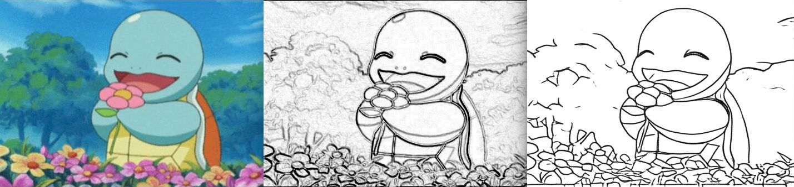   
      
      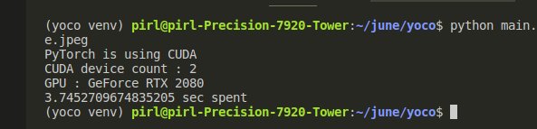   
      
      
      - **TODO(분업)**  
        - 확실히 사용할 라이브러리 Github/논문 분석하면서 발표자료 및 보고서 만들 준비  
          openCV로 엣지맵 생성, SketchSimplification
        - 완전한 폐곡선 구현하기(일단, 현재까지 나온 엣지 이미지 만으로만 해보고 이게 잘 되면 패턴생성 후에도 적용 가능)  
        - 세그멘테이션이미지 기반으로 패턴 입히기  
        - 웹 배포 해보기(대용량 배포 어떻게?)  
        - 
        
      - **Web**
        - [벤치마킹용 웹 서비스](http://thecoloringbook.herokuapp.com/)    
        - 위에 웹에선 컬러링북이 올라가 있지만 우리것은 사용자가 업로드 한 사진으로 컬러링북을 만들어서 거기에다가 색칠할 수 있도록 구현  
        - 우선 웹에서 휴대폰 앨범에 접근하여 사진 업로드 or 촬영 하는 기능 구현하기(아이폰/갤럭시/LG폰 세 개 기종 정도 테스트 해보기)   
    
    - **Segmentation**  
      - 준 : [Self-Correction-Human-Parsing](https://github.com/PeikeLi/Self-Correction-Human-Parsing)   
        - 한 사람에 대해 세그멘테이션 잘 됨     
         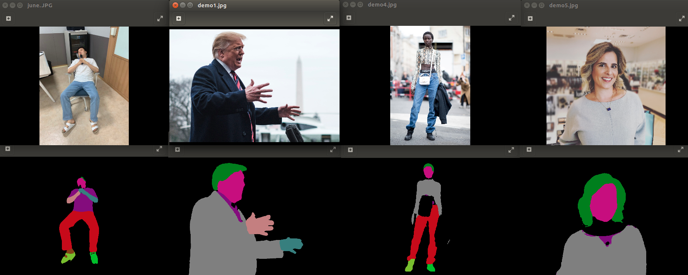   
        - main.py에 합치는 작업 예정  

</div>
</details>    

---  
<details>  
<summary> Collaborators </summary>
<div markdown="1"> 
   
- 김덕민    
 
- 김   준    

- 노희태    

- 서유라   

- 이세원   

- 진예진    

- 한미희

</div>
</details>  
